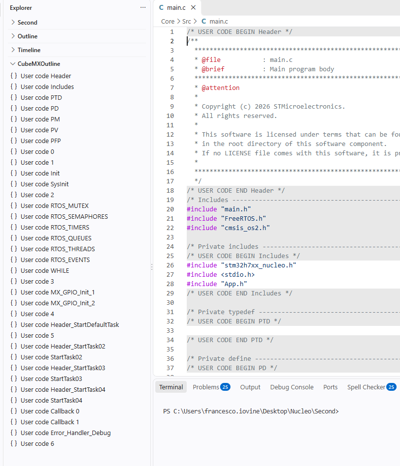
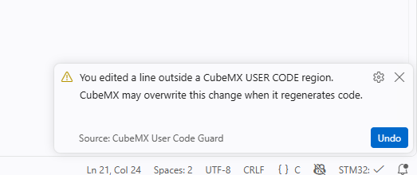

# CubeMX User Code Guard

A small VS Code extension that keeps you from accidentally editing the parts of STM32CubeMX-generated C/C++ files that CubeMX will overwrite.

## Why

STM32CubeMX marks the editable parts of generated source files with special comments:

```c
/* USER CODE BEGIN RTOS_THREADS */
// Your code goes here and survives regeneration
/* USER CODE END RTOS_THREADS */
```

Everything outside these markers belongs to the code generator. When you change the hardware configuration and regenerate, CubeMX may rewrite or delete those lines, and anything you typed there is lost.

In a long generated file it is easy to lose track of where the safe regions are. This extension makes the boundary visible.

## Features

- **Shading:** lines outside `USER CODE BEGIN ...` / `USER CODE END ...` pairs are shaded gray. Lines inside them keep the editor's normal background.

  

- **Edit warning:** if you edit a gray line, a warning tells you the change may be lost when the code is regenerated. It includes an **Undo** button.

  

- **CubeMXOutline view:** a section in the Explorer lists only the user code blocks in the active file, for example `User code RTOS_THREADS`. Selecting one jumps to its first editable line.

## Try it in VS Code

1. Open this folder in VS Code.
2. Press `F5` to launch an Extension Development Host.
3. In that host, open a CubeMX-generated `.c` or `.h` file.
4. In the Explorer sidebar, find the **CubeMXOutline** section. If it is hidden, use **View → Open View… → CubeMXOutline**.

The extension is plain JavaScript using the built-in VS Code API, so there is no build step.

## Build and install a VSIX (Windows)

1. Run `package-vsix.bat` from this folder. It needs Node.js/npm and uses `@vscode/vsce` to package the current source.
2. In VS Code, open **Extensions → … → Install from VSIX…** and select the generated `.vsix` file.

Notes:

- `.vscodeignore` keeps the development launch configuration and the packaging script out of the VSIX.
- To have VS Code treat a new build as an update to an installed version, increase `version` in `package.json` before packaging.

## Settings

| Setting | Description |
| --- | --- |
| `cubemxUserCodeGuard.enabled` | Turn shading and warnings on or off. |
| `cubemxUserCodeGuard.generatedBackground` | Background color for generated lines. |
| `cubemxUserCodeGuard.userCodeBackground` | Background color for editable lines. Defaults to `editor.background`, so it follows your theme. |
| `cubemxUserCodeGuard.warningCooldownMs` | Minimum time between warnings for the same file, in milliseconds. |

## Limitations

This is an early prototype.

- It recognizes only the standard CubeMX marker text in C/C++ files.
- It warns about edits but does not block them.
- It does not guarantee that CubeMX will preserve any part of a generated file.
